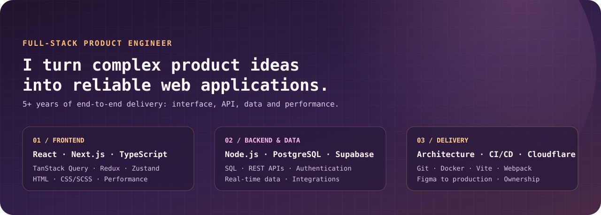

<div align="center">
  
</div>

<div align="center">
  <a href="https://www.linkedin.com/in/iskoropad/"></a>
  <a href="mailto:iliaskoropad@gmail.com"></a>
  
  
</div>

## I build products, not just screens

I'm a **full-stack product engineer with a frontend-first foundation** and 5+ years of experience shipping React and Next.js applications end to end. I connect polished interfaces with reliable APIs, data models, authentication, and production delivery.

```ts
const illia = {
  focus: ["full-stack product development", "data-heavy interfaces", "automation"],
  frontend: ["React", "Next.js", "TypeScript", "application architecture"],
  backend: ["Node.js", "PostgreSQL", "Supabase", "REST APIs", "authentication"],
  principle: "make complex workflows feel simple",
};
```

## Selected impact

| 01 — Analytics platform | 02 — Performance | 03 — Product delivery |
|---|---|---|
| Architected and shipped an internal analytics platform for a **20-person team**. | Raised Lighthouse Performance from **40–50 to 96–99** while modernizing a legacy frontend. | Delivered a production MVP independently in **one month**, then expanded it with exports, domain management, and JWT auth. |
| Built a real-time pipeline handling **4,000–5,000+ events daily** and millions to date. | Replaced fragile jQuery interactions with maintainable modern JavaScript. | Owned architecture, UI, integration, and production delivery end to end. |

## Toolbox

**Frontend**  
`React` · `Next.js` · `TypeScript` · `JavaScript` · `TanStack Query` · `Redux` · `Zustand` · `HTML` · `CSS/SCSS`

**Backend & data**  
`Node.js` · `PostgreSQL` · `Supabase` · `SQL` · `REST APIs` · `Authentication`

**Engineering**  
`Git` · `Docker` · `CI/CD` · `Cloudflare` · `Vite` · `Webpack` · `Figma` · `Performance Optimization`

## Experience snapshot

```text
2023 — now   UNILIME        Frontend Developer
2021 — 2022  NEEDPLEX       Junior Frontend Developer
2021         NOVE AGENCY    HTML Coder
```

<details>
  <summary><b>What I care about when building</b></summary>
  <br />

- Interfaces that stay understandable as the product grows
- Clear data flow, resilient API integration, and useful loading/error states
- Performance that can be measured, not merely described
- Ownership from first product question to production monitoring
- Small abstractions with obvious reasons to exist

</details>

## Let's build something useful

If you're working on a product with complex flows, a data-heavy UI, or an app that needs strong frontend and backend ownership, I'd be glad to talk.

<p>
  <a href="mailto:iliaskoropad@gmail.com"><b>Email me</b></a>
  &nbsp;·&nbsp;
  <a href="https://www.linkedin.com/in/iskoropad/"><b>LinkedIn</b></a>
</p>

---

<sub>Designed as a quiet, technical profile: high signal and no badge wall.</sub>
